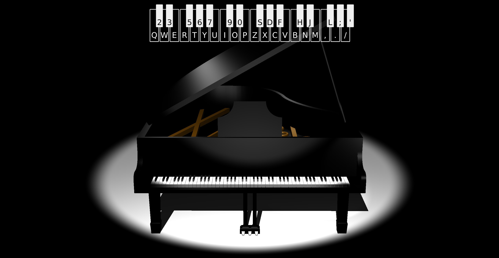
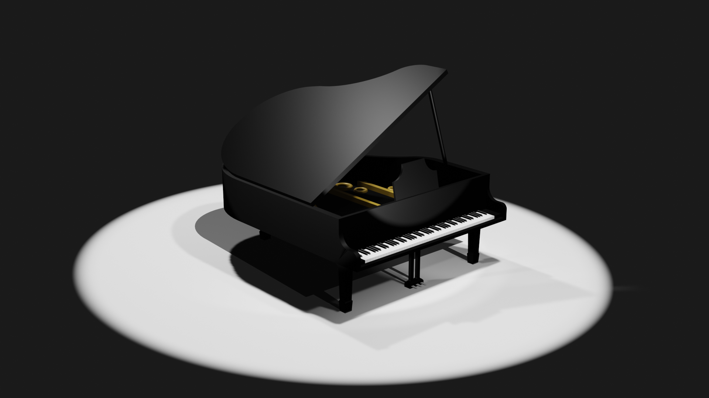

# Virtual Piano

## YouTube Movie how the project came about
https://www.youtube.com/watch?v=EWy4IdaHYFY
## Demo
https://kacperlo.github.io/PianoSite/
## Technologies
Project was made using pure JavaScript (with Three.js Library), HTML & CSS
## Screenshot

## Models
In project there were used models handmade with Blender Software

